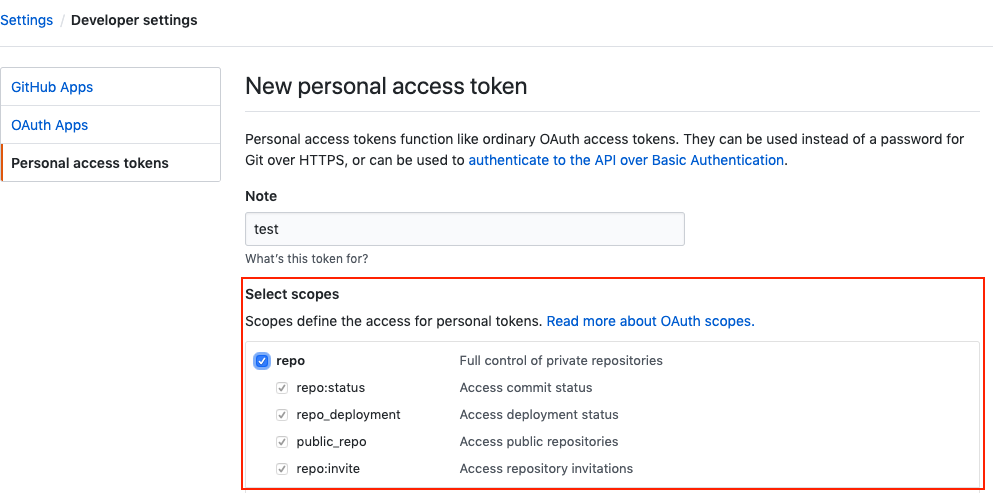

# removeGitCollaborators

## Description

対象のGituhubアカウントの全てのリポジトリから指定したCollaboratorsを削除します。  

## Usage

始めに、Github管理画面の[setting](https://github.com/settings/tokens)からAPIKeyを取得してください。  
その際、Select scopesのrepoをチェックしてください。  
  

アクセストークンを入手したら下記コマンドを実行しapi.jsonを作成します。  
```
curl  "https://api.github.com/user/repos?access_token={token}&per_page=100&page=1&sort=created" > api.json
```

remove.phpの変数を指定します。  
```
$Email = 'hoge@gmail.com';
$PASS = 'password';
$DELTE_USER = 'user_id';
```

remove.phpを実行します。  
```
php remove.php
```


## Supplement
リポジトリは最大で、100個までしか取得できない。  
100個以上のリポジトリを取得する場合は、下記の様に別途追加のjsonファイルを生成し、  
ファイルを指定して再度PHPを実行する。  
```
curl  "https://api.github.com/user/repos?access_token={token}&per_page=100&page=2&sort=created" > api_2.json
```

remove.php
```
$url = './api_2.json';
```
